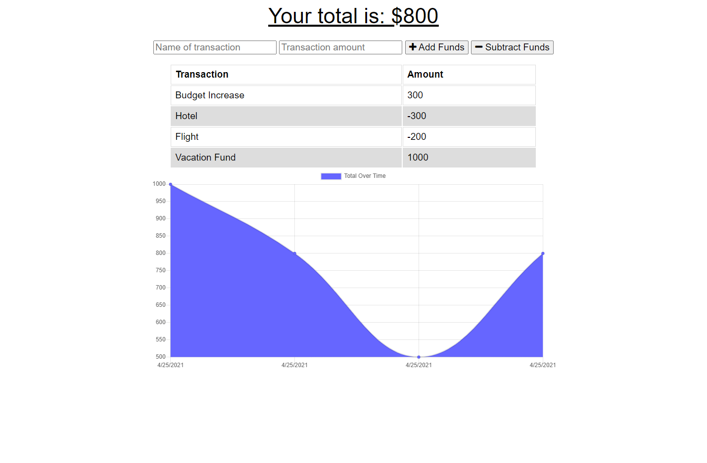

# **Budget Tracker** 

## **Description**
This application will make it easier to keep track of your budget. My task was to make this existing application into a progressive web application. Users will be able to download this onto their devices and access the application outside of their browser. The application will save any offline activity and send it to the database once internet connection is restored.

## **Table of Contents**
* [Application](#application)
* [Technology](#technology)
* [License](#license)
* [Contact](#contact)

### **Application**

Deployed: [Budget Tracker](https://albenchris-budget-tracker.herokuapp.com/)

### **Technology**
* MongoDB
* Mongoose
* Manifest
* Service Workers
* IndexedDB
* Node.js
* Express.js
* Javascript
* HTML
* CSS

### **License**
[ISC](https://opensource.org/licenses/ISC)

### **Contact**
Feel free to contact me with any questions or comments!
* Github: [albenchris](https://github.com/albenchris)
* LinkedIn: [Alexander Christopherson](https://www.linkedin.com/in/alexander-christopherson-2b32085a/)
* Email: albenchris00@gmail.com
